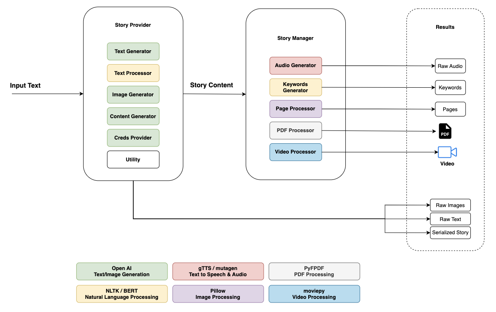

Talesmith AI
==================

The **Talesmith AI** is a Python-based application that creates multimedia storytelling experiences. It uses OpenAI's GPT for text generation, integrates images and audio, and compiles the content into a video using MoviePy and FFmpeg.

Features
--------

*   Generate stories dynamically using OpenAI's GPT models.
*   Generate or integrate images and audio for storytelling.
*   Combine text, images, and audio into a single video file.
*   Add background music for a rich multimedia experience.

* * *

Table of Contents
-----------------

1.  [Installation](#installation)
2.  [Usage](#usage)
3.  [Dependencies](#dependencies)
4.  [Project Structure](#project-structure)
5.  [High\-Level Architecture](#high-level-architecture)
6.  [Configuration](#configuration)
7.  [Contributing](#contributing)
8.  [License](#license)

* * *

Installation
------------

### 1\. Clone the Repository

```bash
git clone https://github.com/amanattar/Talesmith_AI.git
cd Talesmith_AI
```

### 2\. Set Up a Conda Environment

Create and activate a Conda environment with Python 3.10:

```bash
conda create -n ai-story python=3.10 -y
conda activate ai-story
```

### 3\. Install Dependencies

Install the required Python libraries:

```bash
pip install -r requirements.txt
```

### 4\. Install FFmpeg

Ensure FFmpeg is installed and accessible via your PATH:

*   **macOS**: `brew install ffmpeg`
*   **Ubuntu**: `sudo apt update && sudo apt install ffmpeg`
*   **Windows**: Download from [FFmpeg.org](https://ffmpeg.org) and add it to PATH.

* * *

Usage
-----

### Generate a Story from Prompt

```bash
python3 main.py --prompt "The Friendly Panda"
```

### Load an Existing Story and Generate Video

```bash
python3 main.py --pickle ./_stories/2024_12_28_14_03_23-The_Friendly_Manager/story_content.pickle
```

* * *

Dependencies
------------

*   **Python**: 3.10
*   **Libraries**:
    *   `moviepy`: For video and audio processing.
    *   `openai`: For GPT-based story generation.
    *   `Pillow`: For image validation and manipulation.

Install all dependencies using:

```bash
pip install -r requirements.txt
```

* * *

Project Structure
-----------------

```plaintext
Talesmith_AI/
├── main.py                       # Main script to run the project
├── story_provider.py             # Handles story generation and management
├── story_manager.py              # Manages multimedia content
├── data_models.py                # Defines data structures for stories and pages
├── util/                         # Utility scripts for credentials and image generation
│   ├── story_utility.py
│   ├── openai_credentials_provider.py
│   ├── gradient_image.py
├── processors/                   # Content processing scripts
│   ├── video_processor.py
│   ├── text_processor.py
│   ├── pdf_processor.py
│   ├── page_processor.py
├── generators/                   # Modules for generating text, images, audio
│   ├── text_generator.py
│   ├── story_content_generator.py
│   ├── keywords_generator.py
│   ├── image_generator.py
│   ├── audio_generator_gtts.py
├── music/                        # Background music files
│   ├── retro-and-modern-quirky-129655.mp3
│   ├── children-playing-kids-music-112146.mp3
│   ├── best-adventure-ever-122726.mp3
├── images/                       # Placeholder images
│   ├── paper.jpeg
├── fonts/                        # Custom fonts for rendering text
│   ├── Playfulist.ttf
├── docs/                         # Documentation and diagrams
│   ├── high-level-diagram.png
├── credentials/                  # API credentials
│   ├── openai-creds.json
├── _stories/                     # Generated stories and assets
│   ├── 2024_12_28_14_03_23-The_Friendly_Manager/
│       ├── story_content.pickle
│       ├── raw_story.txt
│       ├── keywords.txt
│       ├── final_video.mp4
│       ├── final_story.pdf
│       ├── final_audio.wav
│       ├── pages/
│       ├── images/
│       ├── audio/
├── requirements.txt              # Python dependencies
├── LICENSE                       # License information
├── README.md                     # Project documentation
```

* * *

High-Level Architecture
-----------------------

The following diagram illustrates the architecture of the AI Story Generator:

**Components**:

*   **Story Provider**: Manages text and image generation.
*   **Story Manager**: Handles audio, keywords, page processing, and video compilation.
*   **Results**: Outputs include raw audio, keywords, pages, PDFs, and videos.

* * *

Configuration
-------------

### OpenAI API Key

Store your OpenAI credentials in the `credentials/openai-creds.json` file:

```json
{
    "organization": "xxx-XXXXXXXX",
    "api_key": "your-api-key"
}
```

The application will automatically load these credentials at runtime from the JSON file.

* * *

Contributing
------------

Contributions are welcome! Feel free to fork this repository, create a feature branch, and submit a pull request.

* * *

License
-------

This project is licensed under the MIT License. See the `LICENSE` file for details.

